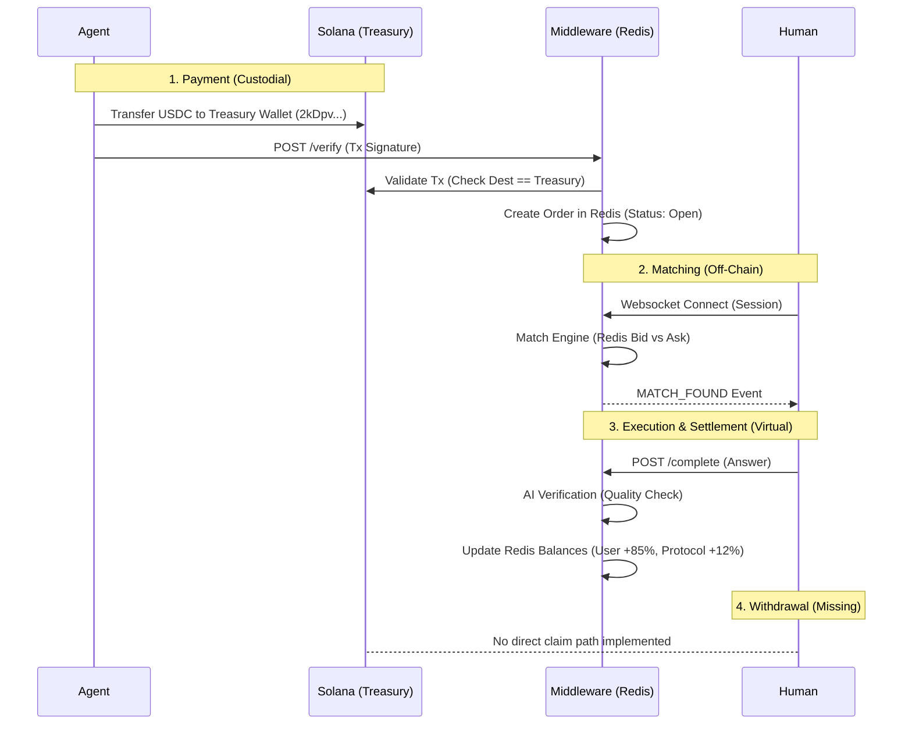
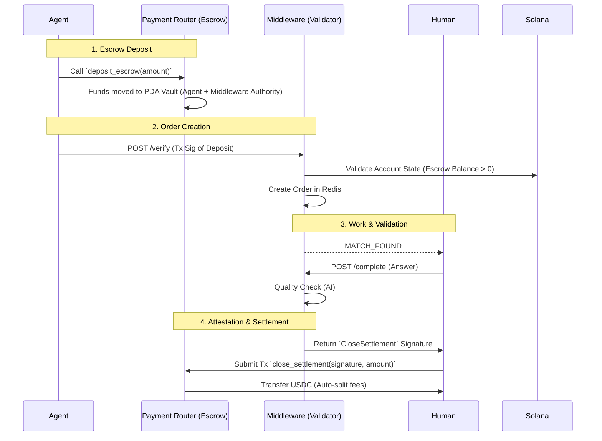

# Attentium Architecture Review & Non-Custodial Plan

> **Date:** 2025-12-26
> **Scope:** Agent → Middleware → Human Workflow
> **Objective:** Analyze architecture and propose non-custodial adjustments.

---

## 1. Current Architecture Analysis

The current Attentium workflow (Attentium x402) operates on a **Custodial / Trusted** model, effectively acting as a centralized bridge between Agents (Buyers) and Humans (Sellers).

### Workflow Diagram (Current)

### Critical Custodial Touchpoints

1.  **The Treasury Wallet (`2kDpv...`)**:
    *   **Risk:** All funds are sent to a single Keypair-controlled wallet. The private key for this wallet must be accessible to the backend (or an admin) to process refunds or payouts.
    *   **Implication:** If the backend/admin key is compromised, *all* funds are lost. Users do not own their earned funds until the backend manually processes a payout.
    *   **Evidence:** `x402OrderBook.ts` (Line 317) explicitly validates transfers where `postBalance.owner === TREASURY`.

2.  **Redis Balances**:
    *   **Risk:** User earnings exist solely as floating point numbers in Redis (`user:{wallet}:balance`).
    *   **Implication:** This is a centralized ledger. It is fast but lacks transparency and is not trustless.
    *   **Evidence:** `MatchController.ts` (Line 150) uses `redisClient.incrementBalance`.

3.  **Missing Withdrawal Route**:
    *   **Observation:** There is no API endpoint in `marketRoutes.ts` or `UserController.ts` for users to initiate a withdrawal of their Redis balance. Currently, this likely requires manual intervention or is points-based ("Season Zero").

---

## 2. Non-Custodial Adjustment Plan

To become **"Completely Non-Custodial"**, the protocol must ensure that:
1.  Agents deposit funds into a **Smart Contract** (Escrow), not a wallet.
2.  The Middleware acts only as an **Oracle/Validator**, signing attestations that work was done.
3.  Humans can **claim funds directly** from the Smart Contract using the attestation, without needing permission for the withdrawal itself.

Fortunately, the `payment_router` Solana program (`c:/.../payment_router/src/lib.rs`) already contains much of the necessary logic (Escrows, PDA Vaults). It is just not currently hooked up to the main workflow.

### Proposed Architecture (Non-Custodial)

### Detailed Implementation Steps

#### Step 1: Activate Payment Router Program
*   **Action:** Deploy the `payment_router` program to Mainnet.
*   **Change:** Instead of a simple USDC transfer, Agents must invoke the `deposit_escrow` instruction.
*   **Security:** The Escrow PDA should be derived from `[b"escrow", agent_key]`.

#### Step 2: Update Agent Middleware (`x402OrderBook.ts`)
*   **Current:** Checks `postTokenBalances` for transfers to Treasury.
*   **New:**
    1.  Parse Transaction to find the `deposit_escrow` instruction.
    2.  Alternatively (and more securely), query the **Solana Account State** of the Escrow PDA to verify the balance exists on-chain.
    *   *Benefit:* Eliminates reliance on fickle transaction logs.

#### Step 3: Implement Validator Signatures (`MatchController.ts`)
*   **Current:** Updates Redis balance.
*   **New:**
    1.  Upon successful completion (`POST /complete`), the backend constructs a `close_settlement` instruction payload.
    2.  The backend **signs** this instruction (as the `market_config.authority` or a delegated signer).
    3.  Returns this **signed transaction (or signature)** to the Human client in the API response.

#### Step 4: Frontend "Claim" Logic
*   **Action:** The Human's browser (Frontend) receives the signature.
*   **Action:** Requires the Human to sign the transaction (as the recipient) and submit it to Solana.
*   **Trade-off:** This requires the Human to pay a small amount of SOL for gas (approx $0.000005). Alternatively, the Backend can act as a **Payer** (Gas Station) and submit the transaction on behalf of the user, keeping the user experience "gasless" while keeping the actual custody on-chair.

### Optimized "Hybrid" Approach (Recommended)
*Pure on-chain settlement for every $0.05 task is inefficient due to TPS limits and dust.*

**Recommendation:** Use **Micropayment Channels** logic using the existing specific Escwow.
1.  **Agent deposits** large batch (e.g., $100).
2.  **Work happens** off-chain.
3.  **Settlement:**
    *   **Option A (Batch):** Backend submits a `close_settlement` transaction every 1 hour, batching payouts to users. (Semi-custodial: user relies on backend to submit).
    *   **Option B (Claim):** Backend provides a "Claimable Balance" signed message. User submits this to the smart contract to withdraw accumulated earnings.

### Summary of Changes

| Component | Current State | Target Non-Custodial State |
| :--- | :--- | :--- |
| **Agent Payment** | Transfer to Keypair Wallet | Deposit to PDA Escrow Vault |
| **Escrow** | None (Funds mixed in Treasury) | Segregated per Agent on-chain |
| **Balance Tracking** | Redis Database | On-Chain Escrow State |
| **Payout** | Manual / Missing | Smart Contract Settlement |
| **Role of Backend** | Custodian & Ledger | Oracle & Validator |

This plan utilizes the existing `payment_router` code which is already written but currently dormant.
